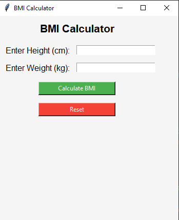

# 🧮 BMI Calculator - Tkinter

A clean and interactive *BMI (Body Mass Index) Calculator* built using *Python Tkinter GUI*.  
It allows users to input height and weight to calculate their BMI and health status, with an easy reset option to start over.

---

## 🚀 Features

- 🔢 Input: Height (in cm) and Weight (in kg)
- 🧠 Real-time BMI calculation using standard formula
- 📊 Health category output:
  - Underweight
  - Normal
  - Overweight
  - Obese
- 🔄 *Reset/Clear All* button to re-enter new values
- 🖱 User-friendly GUI layout & Keyboard data entry
  
---

## 📐 BMI Formula

> *BMI = weight (kg) / (height (m))²*

Example:  
For 160 cm and 60 kg → BMI = 60 / (1.6 × 1.6) = *23.4*

---

## 🛠 Technologies Used

- Python 3.x  
- Tkinter (Python’s built-in GUI library)

---

## 📸 Screenshot

